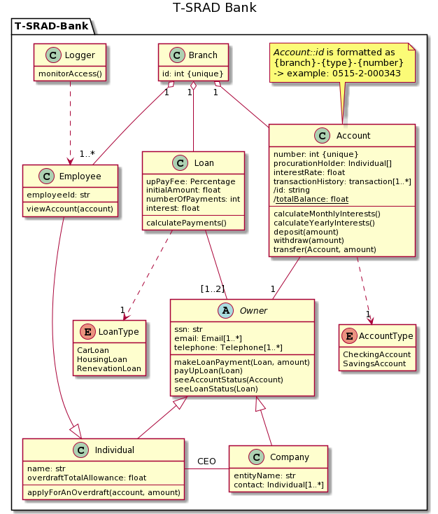

# t-srad-bank

A starting point for a TDD exercise.

## Getting started

Given a modal of a bank system for the T-SRAD Bank; your task is to take the model and start implementing the code required to run the system.



Don't worry, you are part of a larger team tasked with the job. You will only be working on the Account module, and while others are working on the other modules, you can ignore their work for now.

### Running tests locally

#### Easy way

1. You will need to have pytest installed, see more info on the [pytest site][0].
2. To run the tests, simply type: ``pytest -v`` in the root of the project.

#### Cleaner way

Use a virtual environment to keep track of your requirement files.

1. Run ``python -m venv .venv``
2. Run ``source .venv\bin\activate\ `` on MacOS/Linux, or ``.venv/Scripts/activate.bat`` on Windows.
3. Install requirements: ``pip install -r requirements.txt``
4. Run ``pytest -v`` to run tests.

### Step by step directions

1. Locally on your computer, run the following commands:
    - ``git init t-srad-bank``
    - ``cd t-srad-bank``
    - ``git pull https://github.com/arnlaugsson/t-srad-bank``
2. Go to Github.com, create a new repository (private) without initializing it with any files (such as a README or License). Call the new repository t-srad-bank.
3. Again locally, run the following commands:
    - ``git remote add origin https://github.com/USERNAME/t-srad-bank.git`` (where the USERNAME is your username).
    - ``git push t-srad-bank``
4. Verify the content of the repo is now on your GitHub repo.

### TDD instructions

Follow the [Red-Green-Refactor][1] mantra to the fullest. If we see examples where we have functionality changes without tests, that will incur a grading penalty!

Read through all the tasks, but when you are implementing, do only one step at a time.

For <ins>each step</ins>:

1. Read the description.
2. Write a test. Run the test. See the test fail (**Red**).
3. Write the minimum code needed for the test to run. Run the test. See it succeed (**Green**).
4. Review changes, refactor if needed (**Refactor**).
5. Add the changes (``git add``), commit the changes with a descriptive commit message (``git commit -m "step 2: accept float amount"``).

After all steps (or as often as you'd like), push the code to your GitHub repo. [Add @arnlaugsson as a collaborator to the repository before the deadline.][2]

[0]: https://docs.pytest.org/en/stable/getting-started.html
[1]: https://www.codecademy.com/articles/tdd-red-green-refactor
[2]: https://docs.github.com/en/github/setting-up-and-managing-your-github-user-account/inviting-collaborators-to-a-personal-repository

### TDD kata steps

We provided the first step to help get you started. Also, we've provided some test ideas to help with some of the other steps.

1. Track how many accounts exist. **This step is already solved**. Note that we have to reset our Account class's ``numberOfAccounts`` counter between tests.
    - Some test ideas:
        - Verify that the first account to be created gets the number 1.
        - Verify that after creating two accounts, the number of accounts is up to two.
2. Update the Account constructor to accept an ``amount`` (a floating-point number) that sets the account's ``balance`` on creation.
    - Some test ideas:
        - Verify the balance of a newly created account matches the value given on creation as a parameter to the constructor.
3. Add a function, ``withdraw``, that accepts an ``amount`` and deducts that amount from the account.
4. Add a function, ``deposit``, that accepts an ``amount`` and increases the account's balance by that amount.
5. Add a function, ``transfer``, that transfers an ``amount`` from one account to another.
    - Some test ideas:
        - Verify that the donor account balance is reduced.
        - Verify that the recipient's account balance is increased.
        - Verify that the sum of the account balances doesn't change.
6. Add a function, ``__str__``, that returns a zero-padded form of the account number. For example, ``account.__str__()``, for account number 134, should return "000134" (notice the three zeros).
7. Update the Account constructor so that negative initial amounts are not allowed, and trying to create a new account with a negative balance should raise a ``NegativeBalanceNotAllowed`` exception.
    - Note for this; you will have to implement an Exception class.
        - Hint: take a look at pytest.raises
8. Update the withdraw function to prevent account balances from going below 0.0, and trying to withdraw more than the balance allows should raise an ``IllegalWithdrawal`` exception.
9. Update the transfer function to prevent account balances from going below 0.0, and trying to transfer more than the balance allows should raise an ``IllegalTransfer`` exception.
10. For the final part, choose _either_ A) or B) below:
    - A) Implement a transactional history for every account. The transaction history should keep track of all events that have happened to the account. (Hint; you will need to add event storing into each event function, such as the constructor and deposit.) Example:

      ```csv
      event, amount, balance
      create, 0.0, 0.0
      deposit, 150.0, 150.0
      withdraw, 35.0, 115.0
      transfer, 25.0, 90.0
      ```

    - B) Implement a class function that can give the sum of all account balances when called. (Hint: you will need to keep track of all created accounts and sum up their balances on demand).

If you get stuck on a step, you can choose to skip it and move on to the next, but make sure to comment on the commit which step you are working on, so it will be clear if you add it later.
